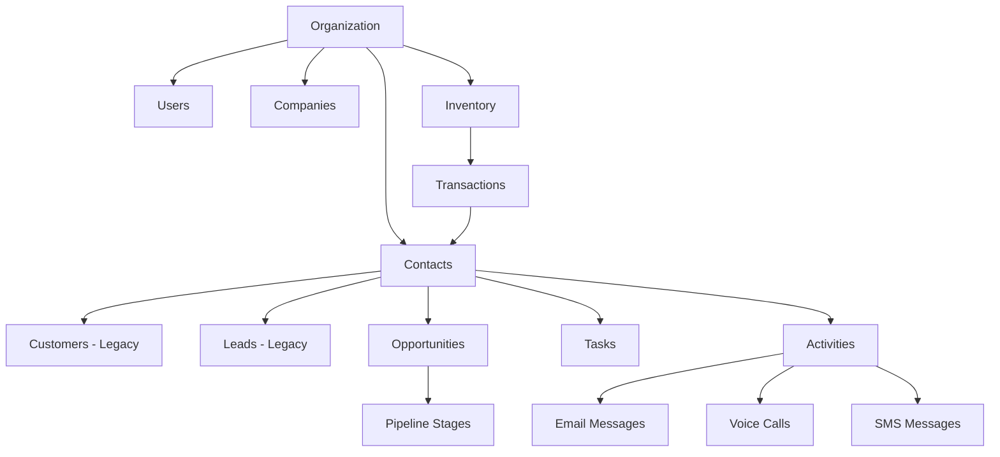
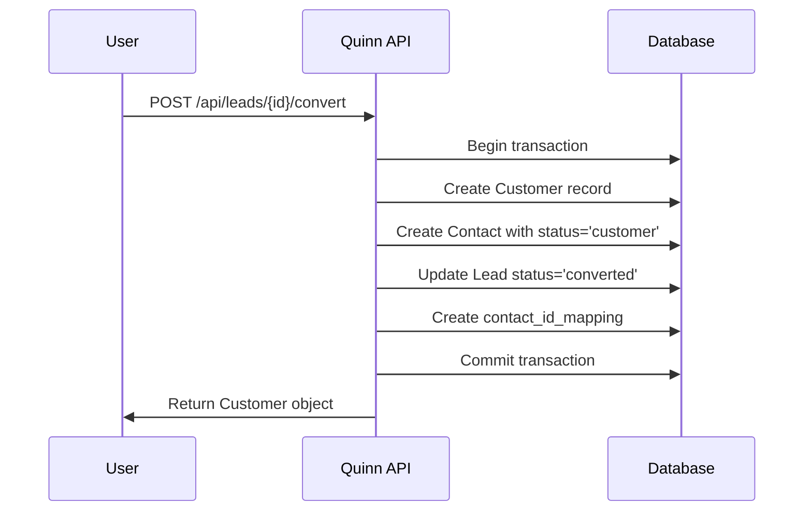
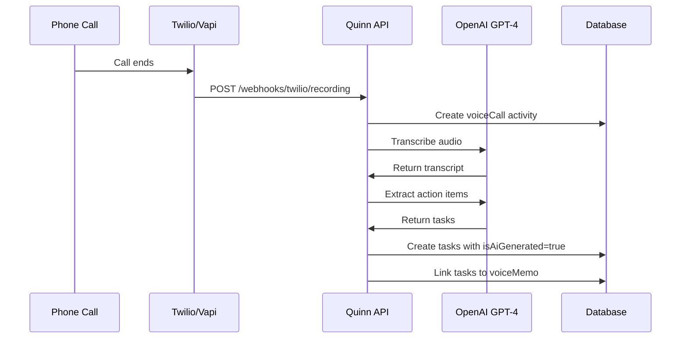

## Data Model

Quinn's data model is built around these core entities:



## Key Entities

### Organization

The top-level tenant in Quinn's multi-tenant architecture. Every user, customer, and record belongs to exactly one organization.

**Key Fields:**
- Business information (name, address, phone, email, website)
- Business hours and timezone
- Feature toggles and AI settings
- Integration credentials (Twilio, Aircall, etc.)

### Contacts (Unified System)

<Info>
Quinn is transitioning to a **unified contact system** that consolidates customers, leads, and unknown contacts into one table.
</Info>

**Contact Statuses:**
- `customer` - Paying customer with transaction history
- `lead` - Sales prospect not yet converted  
- `unknown` - Contact created from inbound communication (call, email) without known status

**Key Fields:**
- Name, email, phone
- Company affiliation
- Owner (assigned team member)
- Last contact date
- Lifecycle status

### Customers (Legacy)

<Warning>
This is a legacy table being phased out. New implementations should use Contacts with `status='customer'`.
</Warning>

Represents equipment rental customers.

**Key Fields:**
- Customer name, contact info
- Billing address
- Company association
- Lifetime order value (calculated)
- Owner assignment

### Leads (Legacy)

<Warning>
Legacy table being phased out. Use Contacts with `status='lead'` instead.
</Warning>

Sales prospects at various stages of qualification.

**Lead Statuses:**
- `new` - Just discovered/imported
- `contacted` - Initial outreach made
- `qualified` - Meets criteria, shows interest
- `negotiation` - Active deal discussion
- `converted` - Became a customer
- `lost` - Not interested / bad fit

**AI Score:** 0-7 rating based on:
- Google rating (if business)
- Review count
- Website quality
- Contact information completeness
- Business keywords

### Companies

B2B accounts representing contractor firms, construction companies, etc.

**Key Fields:**
- Company name, website
- Industry, employee count, revenue
- Google Places ID
- Enrichment data from Ocean.io
- Service areas

**Enrichment Pipeline:**
1. Created from Google Places search OR
2. Linked to contact/lead with company name
3. Ocean.io enrichment adds firmographic data
4. AI analysis of website for sales intelligence

### Opportunities

Deals in your sales pipeline.

**Key Fields:**
- Associated contact/customer
- Pipeline stage
- Estimated value
- Win probability (0-100%)
- Expected close date
- Products/line items

**Lifecycle:**
1. Created manually or AI-generated from conversation
2. Moves through custom pipeline stages
3. AI predicts revenue potential
4. Stage drift detection alerts on stagnant deals
5. Won → Creates transaction OR Lost → Archives

### Tasks

Action items for team members.

**Sources:**
- Manual creation by users
- AI extraction from voice memos
- AI extraction from call transcripts
- AI generation from opportunities
- Automated from workflows

**Key Fields:**
- Title, description
- Assigned user
- Associated contact/customer/opportunity
- Priority (low, medium, high)
- Due date
- `isAiGenerated` flag

### Inventory

Equipment catalog with pricing.

**Key Fields:**
- Item name, number, category
- Daily/weekly/monthly rental rates
- Quantity available
- Specifications
- Image URL

### Transactions

Rental orders/invoices.

**Key Fields:**
- Customer
- Order date, return date
- Line items (inventory × quantity × days)
- Total amount
- Status (pending, completed, cancelled)

### Activities

Communication log across all channels.

**Types:**
- `call` - Voice calls (inbound/outbound)
- `email` - Email messages (sent/received)
- `sms` - SMS messages
- `meeting` - Calendar events

**Key Fields:**
- Associated contact
- Type, direction (inbound/outbound)
- Timestamp
- Transcript/body
- Sentiment analysis
- Source (user, AI, webhook)

## Core Workflows

### Lead → Customer Conversion



### AI Task Extraction



### Email Auto-Link

When an email arrives via webhook:

1. **Find Contact** by email address
2. **If found**: Link email to contact, log activity
3. **If not found**: Create new contact with `status='unknown'`
4. **Auto-subscribe** contact to email sync
5. **AI Analysis**: Extract sentiment, generate summary
6. **Notifications**: Alert assigned owner

## Multi-Tenant Architecture

<Accordion title="How Tenant Isolation Works">
Every database table includes `organizationId` foreign key:

```typescript
export const customers = pgTable("customers", {
  id: uuid("id").primaryKey(),
  organizationId: uuid("organization_id")
    .references(() => organizations.id)
    .notNull(),
  // ... other fields
});
```

**Query Pattern:**
```typescript
// Every storage method requires organizationId
async getCustomers(organizationId: string) {
  return await db
    .select()
    .from(customers)
    .where(eq(customers.organizationId, organizationId));
}
```

**Route Pattern:**
```typescript
app.get("/api/customers", requireAuth, async (req, res) => {
  // req.user.organizationId injected by auth middleware
  const customers = await storage.getCustomers(req.user!.organizationId);
  res.json(customers);
});
```

**Security Guarantees:**
- ✅ No cross-organization data access
- ✅ Foreign key constraints prevent orphaned records
- ✅ TypeScript enforces organizationId parameters
- ✅ Database indexes optimize tenant queries
</Accordion>

## Pagination

All list endpoints support pagination:

```bash
GET /api/customers?page=1&limit=50
```

**Response Format:**
```json
{
  "data": [...],
  "pagination": {
    "currentPage": 1,
    "totalPages": 10,
    "totalItems": 487,
    "pageSize": 50,
    "hasNextPage": true,
    "hasPreviousPage": false
  }
}
```

**Defaults:**
- Page: 1
- Limit: 50 (max 100)

## Filtering & Search

Most endpoints support filtering:

```bash
# Search by name/email
GET /api/customers?search=acme

# Filter by owner
GET /api/leads?ownerId=uuid

# Filter by status
GET /api/opportunities?status=qualified

# Filter by date range
GET /api/transactions?startDate=2024-01-01&endDate=2024-12-31
```

## Sorting

Use `sortBy` and `sortOrder`:

```bash
GET /api/customers?sortBy=lifetimeOrders&sortOrder=desc
```

**Common sort fields:**
- `createdAt`, `updatedAt`
- `name`, `email`
- `lifetimeOrders` (customers)
- `expectedCloseDate` (opportunities)

## Webhooks

Quinn sends webhooks for real-time events:

**Event Types:**
- `lead.created`
- `lead.converted`
- `opportunity.created`
- `opportunity.stage_changed`
- `task.created`
- `task.completed`
- `call.received`
- `email.received`

**Webhook Payload:**
```json
{
  "event": "lead.converted",
  "timestamp": "2024-10-31T12:34:56Z",
  "organizationId": "uuid",
  "data": {
    "leadId": "uuid",
    "customerId": "uuid",
    "convertedBy": "uuid"
  }
}
```

**Security:**
Quinn signs webhooks with HMAC SHA256. Verify signature:

```javascript
const crypto = require('crypto');

function verifyWebhook(payload, signature, secret) {
  const hmac = crypto.createHmac('sha256', secret);
  hmac.update(JSON.stringify(payload));
  const expected = hmac.digest('hex');
  
  return crypto.timingSafeEqual(
    Buffer.from(signature),
    Buffer.from(expected)
  );
}
```

## AI Features

### Task Extraction

Automatically creates tasks from:
- Voice call transcripts
- Voice memo recordings
- Email content
- Meeting notes

**Extraction Process:**
1. Content sent to GPT-4
2. AI identifies action items
3. Tasks created with:
   - Priority assignment
   - Due date suggestion
   - Owner recommendation (based on context)
   - Links to source (voiceMemo, email, etc.)

### Lead Scoring

AI scores leads 0-7 based on:
- **Business signals** (Google rating, reviews, website)
- **Contact quality** (email, phone availability)
- **Firmographic** (industry, size, location)
- **Behavioral** (engagement, response rate)

**Score Ranges:**
- 6-7: Hot leads (auto-enrich with LeadMagic)
- 4-5: Warm leads
- 2-3: Cold leads
- 0-1: Poor fit

### Revenue Prediction

For opportunities, AI predicts:
- Likely close amount
- Win probability
- Expected close date
- Recommended next steps

**Inputs:**
- Historical deal data
- Customer transaction history
- Stage conversion rates
- Seasonality patterns

## Best Practices

<CardGroup cols={2}>
  <Card title="Use Contacts, Not Customers/Leads" icon="users">
    The unified Contact system is the future. Start using `status` field instead of separate tables.
  </Card>
  
  <Card title="Let AI Do the Work" icon="brain">
    Enable AI task extraction and lead scoring. Your team will thank you.
  </Card>
  
  <Card title="Automate Email Sync" icon="envelope">
    All contacts with emails are auto-subscribed to 2-way sync. Never manually log emails.
  </Card>
  
  <Card title="Use Bulk Imports" icon="upload">
    CSV upload for initial data, Snowflake for ongoing syncs, Browse AI for prospecting.
  </Card>
</CardGroup>

---

Ready to start building? Check out the [API Reference](/api-reference/introduction) or explore [Integration Guides](/integrations/overview).
